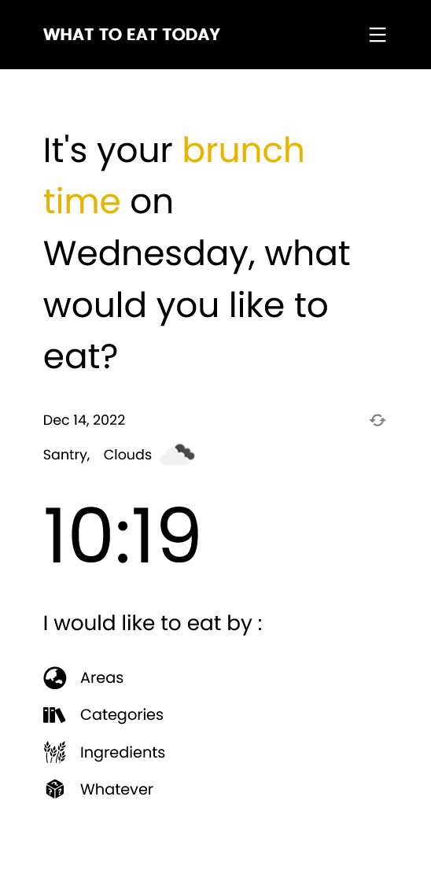

# Screenshot

# Links
- Solution URL: [https://github.com/awsmPuff/what-to-eat-today-app](https://github.com/awsmPuff/what-to-eat-today-app)
- Live Site URL: [https://laurenxx-what-to-eat-today.netlify.app/](https://laurenxx-what-to-eat-today.netlify.app/)

# Bulit With:
- Styled components
- React JS
- React router dom

# Useful Resources:
- [MealDB API] (https://www.themealdb.com/api.php) 
- [OpenWeather API] (https://openweathermap.org/api)
